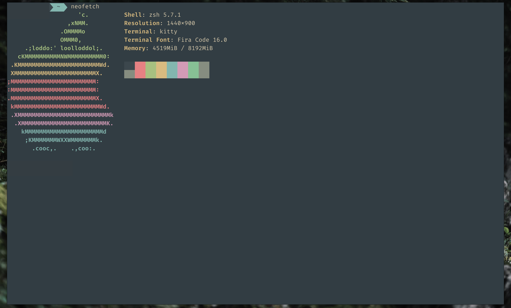

# everforest-kitty

[](https://github.com/RichardLitt/standard-readme)

A port of [sainnhe's](https://github.com/sainnhe) [Everforest theme](https://github.com/sainnhe/everforest) for [kitty](https://sw.kovidgoyal.net/kitty/).



## Install

Download `everforest.conf` and place it under `~/.config/kitty/`

```conf
# ~/.config/kitty/kitty.conf

include everforest.conf
```

## Related

- [sainnhe/everforest](https://github.com/sainnhe/everforest)
- [sainnhe/everforest-vscode](https://github.com/sainnhe/everforest-vscode)
- [huytd/vscode-forest-all-nighter](https://github.com/huytd/vscode-forest-all-nighter)
- [jef/forest-night-iterm](https://github.com/jef/forest-night-iterm)
- [huytd/nvim-forest-all-nighter](https://github.com/huytd/nvim-forest-all-nighter)

## License

[MIT](./LICENSE) © Brian Greenwood
